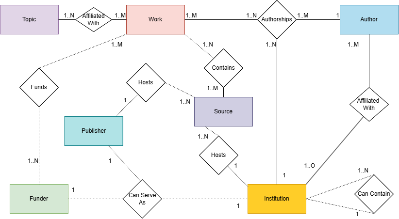

# SFU-Research-Strength-Network-Analysis
This project examines SFU’s research areas of strength, weakness, and growth using OpenAlex data. It includes network analysis to identify key academic collaborations and comparative benchmarking against other institutions. 

## Extracting the data

An ETL.ipynb file is hosted in the root of the project that will interact with the OpenAlex API to extract relevant data relating to SFU and the U15. Running the data can take several hours as OpenAlex limits the frequency of API calls to 10 requests per second with a maximum resultant set of 200 results at a given time. 

## Data Modeling

### Nodes
Each type of OpenAlex object is defined as a node within the graph.

Each Node is given a label that matches with the OpenAlex object, the current labels are:
-   Author
-   Funder
-   Institution
-   Source
-   Work
-   Topic

### Relationships
Each OpenAlex object will have some sort of relationship with another node that defines how the objects meaningfully relate to each other in the graph. The currently assessed relationships are shown in the entity relationship diagram below:
